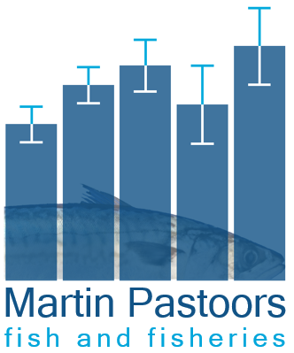

---
output:
  word_document:
    reference_docx: ../report_template_v1.9.dotx
---


```{r setup, include=FALSE}

# ==========================================================================================================
# Generate WQ mackerel sampling overview
# 
# 28/05/2024 first coding
# ==========================================================================================================

knitr::opts_chunk$set(echo = FALSE,	message = FALSE,	warning = FALSE,	comment = "",	crop = TRUE )
knitr::opts_chunk$set(fig.width=10) 

options(dplyr.summarise.inform = FALSE)

# Reset lists
rm(list=ls())

# Libraries
library(rmarkdown)                   # note: requires knitr 1.21

require(tidyverse, quietly=TRUE)     # combined package of dplyr, tidyr, ggplot, readr, purrr and tibble
require(lubridate, quietly=TRUE)     # data handling
require(reshape2, quietly=TRUE)      # reshaping data; e.g. cast
require(RColorBrewer)                # colour schemes
library(viridis)
library(pander)
library(cowplot)
library(patchwork)                   # composer of plots

library(captioner)                   # for captions
tab_nums <- captioner::captioner(prefix = "Table " , levels=1, type=c("n"), infix=".")
fig_nums <- captioner::captioner(prefix = "Figure ", levels=1, type=c("n"), infix=".")

# Source all the utils
source("../../flyshoot/R/FLYSHOOT utils.r")

spatialdir <- "C:/DATA/RDATA"

# spatial data files

load(file.path(spatialdir, "world_mr_sf.RData"))
load(file.path(spatialdir, "world_mr_df.RData"))
load(file.path(spatialdir, "rect_lr_sf.RData"))
load(file.path(spatialdir, "fao_df.RData"))

load(file.path(spatialdir, "world_lr_df.RData"))

load(file.path(spatialdir, "asfis.RData"))

# ===============================================================================
#  Load data
# ===============================================================================

# set onedrive directory
onedrive <- get_onedrive(team="Martin Pastoors", site="WQ - General")

df <-
  readxl::read_excel(
    path  = file.path(onedrive, "makreel","Makreel paaionderzoek 2024.xlsx"),
    sheet = "Haul" 
  ) %>% 
  lowcase() %>% 
  drop_na(date) %>% 
  rename(lon=plotlon, lat=plotlat) %>% 
  mutate(
    year  = lubridate::year(date),
    month = lubridate::month(date),
    week  = lubridate::week(date),
    yday  = lubridate::yday(date),
    mackerelcaught = ifelse(!is.na(picture1), TRUE, FALSE)
  )

# calculate the scaling of plots
xmin <- floor(2 * (min(df$lon, na.rm=TRUE)-0.5))/2 - 1;
xmax <- ceiling(2 * (max(df$lon, na.rm=TRUE)+0.5))/2 + 1;
ymin <- floor(2 * (min(df$lat, na.rm=TRUE)-0.5))/2 - 0.5
ymax <- ceiling(2* (max(df$lat, na.rm=TRUE)+0.5))/2 + 0.5

xlim <- c(xmin, xmax); ylim <- c(ymin, ymax)

```


**WQ 2024 mackerel research to assess spawning of mackerel in the North Sea**

By: Martin Pastoors (MPFF) and Ewout Blom (WMR)

Version: `r format(Sys.time(), '%d/%m/%Y')`

```{r, echo=FALSE, out.width = "150px", fig.align="left", message=FALSE, warning=FALSE, cache=FALSE}
  
# 
p1 <- cowplot::ggdraw() +
            cowplot::draw_image("../MPFF logo with text.png")
p2 <- cowplot::ggdraw() +
            cowplot::draw_image("../Wageningen University and Research.png")

print(patchwork::wrap_plots(p1,patchwork::plot_spacer(), p2, ncol = 3) +
        patchwork::plot_layout(widths  = c(2, 0.4, 4), 
                               heights = c(4, 2, 2)))

```


# Introduction

In 2023, ICES reviewed the available information on mackerel stock structure and concluded that Northeast Atlantic mackerel is a single stock with no separate spawning components. This means that the triennial mackerel and horse mackerel egg survey, will also no longer focus on the individual components. As a result, it has now become extra important to get more information on mackerel reproduction in the southern North Sea and Eastern Channel so that this information can be included in the future mackerel egg survey (2025). 

Here, we are reporting on an exploratory study using the (by-) catch of mackerel in demersal fisheries to assess the spawning status of mackerel in the southern North Sea and Eastern Channel. We have asked demersal skippers to record, measure and take pictures of a limited number of mackerel from their catches. 

**Research question**

What is the spatial and temporal distribution of mackerel reproduction in the southern North Sea and Eastern Channel?

# Methods

Participating skippers took samples of mackerel in the catch from May to July. A limited number of mackerel larger than 25 cm were sampled per week and vessel. The mackerel were measured, cut and photographed on board of the vessels. For each sample, the date, time and position were recorded. Fishing vessels mostly involved in the sampling were: SCH99, UK153, UK225, MDV1 and MDV2. Several other demersal vessels also provided some information (SL9, UK158, UK64, LT43, SCH65, KW145, SL42, KW14, KW45, SCH135). 

The ICES Working Group on Mackerel and Horse Mackerel Egg Surveys (WGMEGS) coordinates the mackerel and horse mackerel egg survey in the Northeast Atlantic and the mackerel egg survey in the North Sea. Mackerel is considered a batch spawner. This means that female fish produce several batches of eggs during the spawning season. Apart from looking at the amount of eggs in the sea, fishing hauls are carried out to catch adult fish. These fish are used for analyses of sex-ratio, maturity, fecundity, atresia and spawning markers. These surveys are carried out every third year. In the survey year research vessels are sampling (only) for a few weeks in the North Sea. This provides information where mackerel are spawning however, this is only every third year and not throughout the spawning period. Commercial fishing vessels are fishing in the North Sea every year and also during the whole spawning period of mackerel. The idea of this project is to see if mackerel catches of commercial fishing vessels can be used to map the spawning areas of mackerel in the North Sea. Commercial fisherman are asked to take images of the gonads of female mackerel and these images are analysed by scientists for the maturity stage (see annex 3 for instruction to fishers). 

WGMEGS uses the Walsh Maturity Scale (Annex 2). This maturity scale is divided in 6 development stages: 1 (Immature), 2 (Developing but functional immature), 3 (Developing and functionally mature), 4 (Actively spawning), 5 (Spawing capable) and 6 (Regressing/ Regenerating). The spawning season for female mackerel begins with the development of the oocytes (oocytes are fish eggs that are still inside of the gonad) and during the spawning season several batches of eggs are spawned until the spawning seasons finishes and the left over oocytes are regenerated. If a female is actively spawning this can be seen by large transparent, hydrating oocytes in the ovary and this is considered stage 4 (Actively spawning). This is the maturity stage we are looking for in this project. If we find a mackerel ovary with hydrated transparent oocytes we consider this fish as actively spawning (Y), if not we consider this fish as not actively spawning (N). We do not look at other development stages. We have also decided to only look at the females because they are a better indicator for actively spawning. Males are considered to constantly produce milt for a longer period during the spawning season and because of that a less good indicator for actively spawning.  

To be able to see if female mackerel are actively spawning, fishers were to provide three images: one image with the whole fish and the body cavity cut open, one zoomed in image with the gonad inside of the body cavity and one image with zoomed in on the dissected gonad. These images are analysed by scientists to see if hydrated transparent oocytes are present. If one or more hydrated transparent oocytes are present the fish is considered actively spawning (Y). The photographs were assessed by WMR to determine sex and spawning status. 

# Results 

**Sampling overview**

Sampling for mackerel started in May 2024 and continued to July 2024 and was further executed with low intensity in November and December 2024. 

Trips with mackerel

```{r echo=FALSE, fig.align="center", fig.asp=1.2, message=FALSE, warning=FALSE}

tab_nums(
  name    = "sampling1", 
  level = 1, display = FALSE,
  caption = "Mackerel sampling overview 2024")

t <-
  df %>%
  group_by(year, month, week, mackerelcaught) %>% 
  summarise(
    ntrips    = n_distinct(vessel, year, month, week),
    nsamples  = sum(!is.na(picture1)),
    nlength   = sum(!is.na(length)),
    nsex      = sum(!is.na(sex)),
    nspawning = sum(!is.na(paaiend))
  ) %>% 
  tidyr::pivot_longer(names_to = "variable", values_to = "data", ntrips:nspawning) %>% 
  mutate(variable = factor(variable, levels=c("ntrips","nsamples","nlength","nsex","nspawning"))) 

t %>% 
  filter(mackerelcaught) %>% 
  reshape2::dcast(month+week ~ variable, sum, value.var = "data",  margins=c("month")) %>% 
  pander::pandoc.table(.,
               style = "simple",
               split.tables=400, 
               missing=".",
               round=c(0,0,0,0,0,0,0,0,0,0,0,0,0,0,0,0,0,0,0,0,0))


```

Trips without mackerel

```{r echo=FALSE, fig.align="center", fig.asp=1.2, message=FALSE, warning=FALSE}

t %>% 
  filter(!mackerelcaught) %>% 
  reshape2::dcast(month+week ~ variable, sum, value.var = "data",  margins=c("month")) %>% 
  pander::pandoc.table(.,
               style = "simple",
               split.tables=400, 
               missing=".",
               round=c(0,0,0,0,0,0,0,0,0,0,0,0,0,0,0,0,0,0,0,0,0))
  
```

_`r tab_nums("sampling1")`_

**Mean lengths of mackerel sampled**

```{r echo=FALSE, fig.align="center", fig.asp=1.2, message=FALSE, warning=FALSE}

tab_nums(
  name    = "length1", 
  level = 1, display = FALSE,
  caption = "Mean length of mackerel sampled (n is the number of fish)")

df %>%
  filter(mackerelcaught) %>% 
  group_by(month, week) %>% 
  summarise(
    meanlength    = mean(length, na.rm=TRUE),
    n             = sum(!is.na(length))
  ) %>% 
  pander::pandoc.table(.,
               style = "simple",
               split.tables=400, 
               missing=".",
               round=c(0,0,1,0,0,0,0,0,0,0,0,0,0,0,0,0,0,0,0,0,0))


```

_`r tab_nums("length1")`_

**Sex of mackerel sampled**

Sex determination of the mackerel sampled. 

```{r echo=FALSE, fig.align="center", fig.asp=1.2, message=FALSE, warning=FALSE}

tab_nums(
  name    = "sex1", 
  level = 1, display = FALSE,
  caption = "Number of mackerel sampled per sex (F=female, M=male, U=unknown")

df %>%
  filter(mackerelcaught) %>% 
  group_by(year, month, week, sex) %>% 
  summarise(
    n    = sum(!is.na(sex))
  ) %>% 
  reshape2::dcast(month+week ~ sex, sum, value.var = "n",  margins=c("month")) %>% 
  pander::pandoc.table(.,
               style = "simple",
               split.tables=400, 
               missing=".",
               round=c(0,0,0,0,0,0,0,0,0,0,0,0,0,0,0,0,0,0,0,0,0))

```

_`r tab_nums("sex1")`_

**Spawning or non-spawning mackerel** 

Asssessment of whether mackerel were spawning or not-spawning. 

```{r echo=FALSE, fig.align="center", fig.asp=1.2, message=FALSE, warning=FALSE}

tab_nums(
  name    = "spawning1", 
  level = 1, display = FALSE,
  caption = "Number of mackerel in spawning condition or not (Y*=xxx, Y/N=unknown)")

df %>%
  filter(mackerelcaught) %>% 
  group_by(year, month, week, paaiend) %>% 
  summarise(
    n    = sum(!is.na(paaiend))
  ) %>% 
  drop_na(paaiend) %>% 
  reshape2::dcast(month+week ~ paaiend, sum, value.var = "n",  margins=c("month")) %>% 
  pander::pandoc.table(.,
               style = "simple",
               split.tables=400, 
               missing=".",
               round=c(0,0,0,0,0,0,0,0,0,0,0,0,0,0,0,0,0,0,0,0,0))

```

_`r tab_nums("spawning1")`_

\newpage

**Overview of sampling and mackerel caught (by week)**

```{r echo=FALSE, fig.align="center", fig.asp=1.2, message=FALSE, warning=FALSE}


fig_nums(
  name    = "sampling1", 
  level = 1, display = FALSE,
  caption = "Number of mackerel in spawning condition or not, by week.")
  
ggplot() +

  theme_publication() +
  theme(
    text             = element_text(size=12),
    plot.margin      = unit(c(0,0,0,0), "cm"),
    legend.position  = "right",
    legend.direction = "vertical"
  ) +

  coord_quickmap(xlim=xlim , ylim=ylim) +

  geom_polygon(data=world_mr_df, aes(x=long, y=lat, group=group), fill = "grey75") +
  geom_polygon(data=fao_df,   aes(long, lat, group=group), fill = NA, size=0.25, color="black") +

  # geom_point(data=slice(tt, c(1,nrow(tt))),
  #           aes(x=lon, y=lat),
  #           colour="red", size=5) +

  geom_point(data=filter(df, !mackerelcaught), 
             aes(x=lon, y=lat),
              alpha = 0.5, shape=3) +
  geom_point(data=filter(df, mackerelcaught, !grepl("Y", paaiend)), 
             aes(x=lon, y=lat),
             alpha = 0.5, colour="black") +
  geom_point(data=filter(df, mackerelcaught, grepl("Y", paaiend)), 
             aes(x=lon, y=lat),
             alpha = 0.5, colour="red") +

  labs(x = NULL, y = NULL, colour="",
       title=paste("Mackerel spawning and non-spawning samples per week"),
       caption = "red is spawning, black is non-spawning, + means no mackerel caught") +
  guides(size = guide_legend(nrow = 1)) + 
  facet_wrap(~week)

```

_`r fig_nums("sampling1")`_

\newpage

```{r echo=FALSE, fig.align="center", fig.asp=1.2, message=FALSE, warning=FALSE}

fig_nums(
  name    = "sampling2", 
  level = 1, display = FALSE,
  caption = "Number of mackerel in spawning condition or not, by month")

ggplot() +

  theme_publication() +
  theme(
    text             = element_text(size=12),
    plot.margin      = unit(c(0,0,0,0), "cm"),
    legend.position  = "right",
    legend.direction = "vertical"
  ) +

  coord_quickmap(xlim=xlim , ylim=ylim) +

  geom_polygon(data=world_mr_df, aes(x=long, y=lat, group=group), 
               fill = "grey75") +
  geom_polygon(data=fao_df,   aes(long, lat, group=group), 
               fill = NA, size=0.25, color="black") +

  geom_point(data=filter(df, mackerelcaught, !grepl("Y", paaiend)), 
             aes(x=lon, y=lat),
             alpha = 0.5, colour="black") +
  geom_point(data=filter(df, !mackerelcaught), 
             aes(x=lon, y=lat),
              alpha = 0.5, shape=3) +
  geom_point(data=filter(df, mackerelcaught, grepl("Y", paaiend)), 
             aes(x=lon, y=lat),
             alpha = 0.5, colour="red") +
  labs(x = NULL, y = NULL, colour="",
       title=paste("Mackerel spawning-non-spawning samples per month"),
       caption = "red is spawning, black is non-spawning") +
  guides(size = guide_legend(nrow = 1)) + 
  facet_wrap(~month)

```

_`r fig_nums("sampling2")`_

\newpage

```{r echo=FALSE, fig.align="center", fig.asp=0.5, message=FALSE, warning=FALSE}
fig_nums(
  name    = "spawning1", 
  level = 1, display = FALSE,
  caption = "Number of mackerel in spawning condition or not, by week. Top: number of fish, bottom: proportions")

p1 <-
  df %>% 
  filter(mackerelcaught) %>% 
  group_by(week, paaiend) %>% 
  summarise(n=n()) %>% 
  group_by(week) %>% 
  mutate(prop = n / sum(n)) %>% 

  ggplot(aes(x=week, y=n)) +
  theme_publication() +
  theme(
    text             = element_text(size=12),
    plot.margin      = unit(c(0,0,0,0), "cm")
  ) +
  geom_bar(aes(fill=paaiend), stat="identity") +
  guides(fill = guide_legend(nrow = 1)) +
  labs(fill="spawning")

p2 <- 
  df %>% 
  filter(mackerelcaught) %>% 
  group_by(week, paaiend) %>% 
  summarise(n=n()) %>% 
  group_by(week) %>% 
  mutate(prop = n / sum(n)) %>% 

  ggplot(aes(x=week, y=n)) +
  theme_publication() +
  theme(
    text             = element_text(size=12),
    plot.margin      = unit(c(0,0,0,0), "cm")
  ) +
  geom_bar(aes(fill=paaiend), stat="identity", position="fill") +
  scale_y_continuous(labels = scales::percent) +
  guides(fill = guide_legend(nrow = 1)) +
  labs(fill="spawning", y="")

p1 + p2 + plot_layout(guides = "collect") & theme(legend.position = 'bottom') 

```

_`r fig_nums("spawning1")`_

# Discussion

This project aimed to demonstrate the potential of collecting spawning information on mackerel in the North Sea from demersal fishing vessels. Although the project only started in May 2024, we have demonstrated that spawning mackerel is being caught by demersal vessels in the southern North Sea and that there is capacity to process mackerel on board of these vessels, although it should be acknowledged that the time for processing such samples is limited. With the sampling, we could trace, at least, the second part the mackerel spawning season in the North Sea.  It is unfortunate that the project only started in the end of May as the spawning of mackerel had already started by then. It is recommended that for future studies, the sampling starts substantially earlier (i.e. early April). 

Taking photos of mackerel samples proved feasible but challenging, especially for the detailed photos of gonads. Many different types of cameras have been deployed and with different resolutions. It would be recommended to better standardize the photos by technical instructions and by providing feedback on images received. 

Length measurement of sampled fish on demersal vessels could be improved by supplying standard measuring boards to the vessels and by giving more detailed instructions on the measurement process. 

The spatial distribution of mackerel reproduction in the southern North Sea was shown to take place between 51 and 55 degrees latitude and between 2 and 6 degrees longitude (east). The temporal distribution was from May until early July. No spawning activitity has been demonstrated in the Eastern English Channel. 

# Annex 1: individual samples of mackerel with location, date and status. 

```{r eval=FALSE, fig.align="center", fig.asp=1.2, message=FALSE, warning=FALSE, include=FALSE}

# NOT SHOWN

tmp <- data.frame(stringsAsFactors = FALSE)

# w <- 20

for (w in unique(df$week)) {
  t <-
    df %>% 
    filter(week == w) 
  
  # plot spatial overview for this week
    p <- 
      ggplot() +

      theme_publication() +
      theme(
        text             = element_text(size=12),
        plot.margin      = unit(c(0,0,0,0), "cm"),
        legend.position  = "right",
        legend.direction = "vertical"
      ) +
    
      coord_quickmap(xlim=xlim , ylim=ylim) +
    
      geom_polygon(data=fao_df,   aes(long, lat, group=group), fill = NA, size=0.25, color="grey20") +
      geom_polygon(data=world_mr_df, aes(x=long, y=lat, group=group), fill = "grey75") +
    
      # geom_point(data=slice(tt, c(1,nrow(tt))),
      #           aes(x=lon, y=lat),
      #           colour="red", size=5) +
    
      geom_point(data=filter(t, mackerelcaught), 
                 aes(x=lon, y=lat),
                  alpha = 0.4) +
      geom_point(data=filter(t, !mackerelcaught), 
                 aes(x=lon, y=lat),
                  alpha = 1, shape=3) +
      labs(x = NULL, y = NULL, colour="",
           title=paste("Makreel monsters per week"),
           caption = "+ betekent geen makreel gevangen of bemonsterd") +
      guides(size = guide_legend(nrow = 1)) + 
      facet_wrap(~week, ncol=1)

    print(p)
    
  # now picture 1
  t <-
    df %>% 
    filter(week == w) %>% 
    filter(!is.na(picture1))

  if (nrow(t)>0) {
    
    # picture1
    p <- list()
    # n <- 1
    for (n in 1:nrow(t)) {
      
      pl     <- magick::image_read(file.path(onedrive, "makreel", t$picture1[n]))
      if (magick::image_info(pl)$height > magick::image_info(pl)$width) 
        pl <- magick::image_rotate(pl, 270)
      tmp <- 
        bind_rows(
          tmp, 
          data.frame(
            i = n,
            picture = t$picture1[n],
            height = magick::image_info(pl)$height,
            width  = magick::image_info(pl)$width
          ))  
      
      p[[n]] <- cowplot::ggdraw() +
                # cowplot::draw_image(file.path(onedrive, "WQ","makreel",t$picture1[n])) +
                cowplot::draw_image(pl) +
                cowplot::draw_figure_label(paste(t$vessel[n],t$date[n]), 
                                           size = 10, family = "Avenir")
      # print(p[[n]])
    }
    print(patchwork::wrap_plots(p, ncol = 2) + 
            patchwork::plot_annotation(title=paste('Week',w, "Hele makreel")) )
  
    
  }
  
  # picture 3
  t <-
    df %>% 
    filter(week == w) %>% 
    filter(!is.na(picture3))

  if (nrow(t)>0) {
    
    # picture1
    p <- list()
    # n <- 1

    # picture3
    p <- list()
    for (n in 1:nrow(t)) {
      p[[n]] <- cowplot::ggdraw() +
                draw_image(file.path(onedrive, "makreel",t$picture3[n])) +
                cowplot::draw_figure_label(paste(t$vessel[n],t$date[n]), size = 10, family = "Avenir")
    }
    print(patchwork::wrap_plots(p, ncol = 2) + patchwork::plot_annotation(title=paste('Week',w, "Kuit / Hom")) )
    
  }
}

```


```{r echo=FALSE, fig.align="center", fig.asp=0.4, message=FALSE, warning=FALSE}

tmp <- data.frame(stringsAsFactors = FALSE)

# w <- 20

for (w in unique(df$week)) {

  # now picture 1
  t <-
    df %>% 
    filter(week == w) %>% 
    filter(!is.na(picture1))

  if (nrow(t)>0) {
    
    # n <- 1
    
    for (n in 1:nrow(t)) {
    
      p0 <- 
        ggplot() +
        theme_publication() +
        theme(
          text             = element_text(size=12),
          plot.margin      = unit(c(0,0,0,0), "cm"),
          legend.position  = "right",
          legend.direction = "vertical"
        ) +
        coord_quickmap(xlim=xlim , ylim=ylim) +
        geom_polygon(data=world_mr_df, aes(x=long, y=lat, group=group), 
                     fill = "grey85", colour="grey25") +
      
        geom_point(data=t[n,], 
                   aes(x=lon, y=lat),
                   size=2) +
        labs(x = NULL, y = NULL)
      
      # ggsave("tempfig.png", p0, width = 3, height = 5, dpi = 72)
      # pl     <- magick::image_read("tempfig.png")
      # p0 <- cowplot::ggdraw() + cowplot::draw_image(pl) 
      
      # picture1
      pl     <- magick::image_read(file.path(onedrive, "makreel", t$picture1[n]))
      if (magick::image_info(pl)$height > magick::image_info(pl)$width) 
        pl <- magick::image_rotate(pl, 270)
      
      p1 <- cowplot::ggdraw() +
                cowplot::draw_image(pl) 
      
      if (!is.na(t$picture3[n])) {
        p2 <- cowplot::ggdraw() +
              cowplot::draw_image(file.path(onedrive, "makreel",t$picture3[n]))
        print(patchwork::wrap_plots(p0,p1,p2, ncol = 3) +
                patchwork::plot_layout(width=c(1, 2.5, 2.5)) +
                patchwork::plot_annotation(title=paste0(format(t[n,]$date, "%d/%m/%Y"),
                                                       ", Sex:", t[n,]$sex,
                                                       ", Length:", t[n,]$length, 
                                                       ", Spawning:", t[n,]$paaiend)) )
        
      } else {
        print(patchwork::wrap_plots(p0, p1, ncol = 3) +
                patchwork::plot_layout(width=c(1, 2.5)) +
                patchwork::plot_annotation(title=paste0(format(t[n,]$date, "%d/%m/%Y"),
                                                       ", Sex:", t[n,]$sex,
                                                       ", Length:", t[n,]$length, 
                                                       ", Spawning:", t[n,]$paaiend)) )
        
      }
    } # end of n
  } # end of t
} # end of w


```
